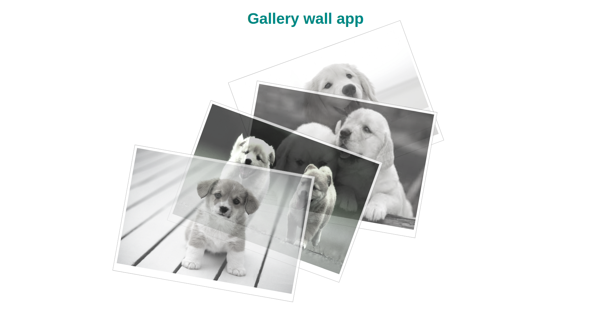

# Gallery wall app

Build a gallery image app using HTML and CSS to practice basic CSS.

# Image gallery App

## Table of Contents

### About The Project

**Gallery App project**

- Built With
  - HTML;
  - CSS;

### Getting Started

- Prerequisites
  - vsCode;
  - Chrome browser

### Usage

- HTML;
- CSS;
- Google fonts.

### Contributing

## Iulian Stan

### License

- Copyright protected

### Contact

[**Iulian Stan**](https://github.com/iulianSta)

### Acknowledgement

### I want to thank to the [**DCI**](https://www.digitalcareerinstitute.org) team and teachers!
